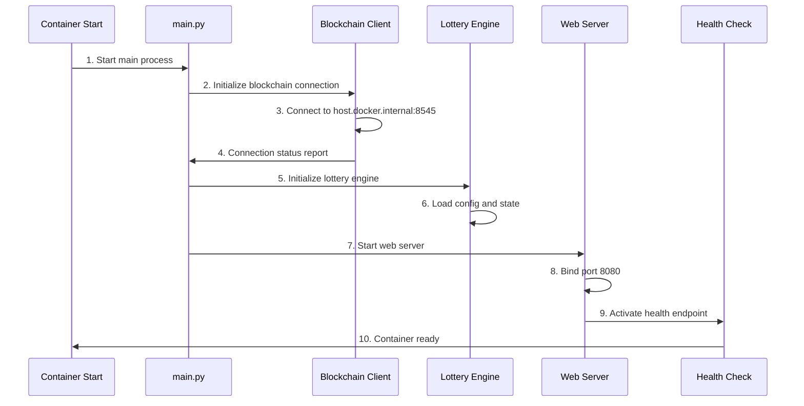

# 🐳 Docker Architecture - Detailed Explanation

## Overview

This document provides a detailed description of the Enclave Lottery App's architecture when running in a Docker environment, including startup order, component dependencies, and deployment configuration.

## 🏗️ Docker Environment Architecture

### Overall Architecture Diagram

```
┌─────────────────────────────────────────────────────────────────────┐
│                        Host Environment                             │
├─────────────────────────────────────────────────────────────────────┤
│  ┌─────────────────┐  ┌─────────────────┐  ┌─────────────────────┐    │
│  │  Local Blockchain│  │   User Browser  │  │   Development Tools │    │
│  │    (Anvil)      │  │   (MetaMask)    │  │   (VS Code, etc)    │    │
│  │     :8545       │  │                 │  │                     │    │
│  └─────────────────┘  └─────────────────┘  └─────────────────────┘    │
│           │                    │                        │             │
│           │                    │                        │             │
├───────────┼────────────────────┼────────────────────────┼─────────────┤
│           │                    │                        │             │
│  ┌─────────────────────────────────────────────────────────────────┐  │
│  │              Docker Container Environment                       │  │
│  │                                                               │  │
│  │  ┌─────────────────────────────────────────────────────────┐   │  │
│  │  │                Enclave Lottery App                    │   │  │
│  │  │                                                       │   │  │
│  │  │  ┌─────────────┐  ┌──────────────┐  ┌──────────────┐  │   │  │
│  │  │  │ FastAPI     │  │ Lottery      │  │ Blockchain   │  │   │  │
│  │  │  │ Server      │  │ Engine       │  │ Client (Web3)│  │   │  │
│  │  │  │   :8080     │  │              │  │              │  │   │  │
│  │  │  └─────────────┘  └──────────────┘  └──────────────┘  │   │  │
│  │  │           │               │                │          │   │  │
│  │  │  ┌─────────────┐  ┌──────────────┐  ┌──────────────┐  │   │  │
│  │  │  │ React Front  │  │ Bet Manager  │  │ Contract     │  │   │  │
│  │  │  │ (static files)│  │ (Bet Mgr)    │  │ Interface    │  │   │  │
│  │  │  └─────────────┘  └──────────────┘  └──────────────┘  │   │  │
│  │  │                                                       │   │  │
│  │  └─────────────────────────────────────────────────────────┘   │  │
│  │                            │                                   │  │
│  └────────────────────────────┼───────────────────────────────────┘  │
│                               │                                      │
└───────────────────────────────┼──────────────────────────────────────┘
                                │
                   ┌─────────────────────┐
                   │   Network Mapping   │
                   │ host.docker.internal│
                   │ → localhost:8545    │
                   └─────────────────────┘
```

## 📦 Docker Image Composition

### Base image: `python:3.11-slim`

```dockerfile
FROM python:3.11-slim
```

**Why this image:**
- Lightweight Python runtime
- Includes necessary system libraries and tools
- Timely security updates; suitable for production

### System packages

```dockerfile
RUN apt-get update && apt-get install -y \
    curl \
    && rm -rf /var/lib/apt/lists/*
```

**Installed system packages:**
- `curl`: used for health checks and API calls
- Clean apt cache to reduce image size

### Python dependency layer

```dockerfile
COPY requirements.txt .
RUN pip install --no-cache-dir -r requirements.txt
```

**Key Python dependencies:**
- `fastapi==0.104.1` - Web framework
- `uvicorn==0.24.0` - ASGI server
- `websockets==12.0` - WebSocket support
- `web3>=7.0.0` - Ethereum client
- `eth-account>=0.13.0` - Ethereum account management
- `cryptography==41.0.7` - Cryptographic functionality
- `pydantic==2.5.0` - Data validation
- `aiofiles==23.2.1` - Asynchronous file operations
- `structlog==23.2.0` - Structured logging

## 🚀 Container Startup Order

### 1. Pre-start checks

```bash
# Healthcheck configuration
HEALTHCHECK --interval=30s --timeout=10s --start-period=5s --retries=3 \
  CMD curl -f http://localhost:8080/api/health || exit 1
```

**Checks performed:**
- Container network connectivity
- Base system services availability
- Python environment integrity

### 2. Application startup

```python
# main.py startup flow
async def main():
    logger.info("Initializing Lottery Enclave Application")
    
    # Step 1: initialize blockchain client
    blockchain_client = BlockchainClient()
    await blockchain_client.initialize()
    
    # Step 2: initialize lottery engine
    lottery_engine = LotteryEngine(blockchain_client)
    
    # Step 3: start web server
    web_server = WebServer(lottery_engine)
    await web_server.start()
```

### 3. Detailed startup sequence



## 🔧 Component Details

### 1. FastAPI Web Server

**File location:** `src/web_server.py`

**Responsibilities:**
- Provide REST API endpoints
- Handle WebSocket connections
- Serve static frontend files
- User authentication and session management

**Port configuration:**
- Container internal port: `8080`
- Host mapped port: `8081` (Docker Demo mode)

**Main endpoints:**
```python
# Health check
GET /api/health

# Lottery status
GET /api/status
GET /api/draw/current
GET /api/draw/history

# Betting operations
POST /api/bet
GET /api/user/{address}/bets

# WebSocket
WS /ws
```

### 2. Lottery Engine

**File location:** `src/lottery/engine.py`

**Core responsibilities:**
- Manage lottery round lifecycle
- Process user bet requests
- Execute RNG and drawing
- Maintain bet history and statistics

**Key components:**
```python
class LotteryEngine:
    def __init__(self):
        self.bet_manager = BetManager()      # bet management
        self.scheduler = DrawScheduler()     # draw scheduling
        self.rng = SecureRandomGenerator()   # random number generator
```

**State machine:**
- `betting` - accepting bets
- `drawing` - drawing in progress
- `completed` - round finished

### 3. Blockchain Client

**File location:** `src/blockchain/client.py`

**Responsibilities:**
- Communicate with Ethereum networks
- Interact with smart contracts
- Sign and send transactions
- Listen for and handle events

**Network configuration:**
```python
# Container environment configuration
ETHEREUM_RPC_URL = "http://host.docker.internal:8545"
CONTRACT_ADDRESS = "0xf39Fd6e51aad88F6F4ce6aB8827279cffFb92266"
```

**Connection flow:**
1. Read environment variables
2. Initialize Web3 connection
3. Verify network connectivity
4. Load smart contract ABI
5. Establish event listeners

### 4. React Frontend

**File location:** `src/frontend/`

**Build artifacts:**
- Compiled static files live in the `dist/` directory
- Served by FastAPI static file handler

**Key components:**
- `App.tsx` - main app component
- `BettingPanel.tsx` - betting UI
- `LotteryTimer.tsx` - countdown display
- `ActivityFeed.tsx` - activity stream
- `WalletConnection.tsx` - wallet integration

## 🌐 Network Configuration

### Container networking

```bash
# Docker run command
docker run -d \
  --name enclave-demo \
  -p 8081:8080 \
  --add-host host.docker.internal:host-gateway \
  -e ETHEREUM_RPC_URL=http://host.docker.internal:8545 \
  -e CONTRACT_ADDRESS=0xf39Fd6e51aad88F6F4ce6aB8827279cffFb92266 \
  enclave-lottery-app:latest
```

**Networking notes:**

1. **Port mapping:** `-p 8081:8080`
   - Host port 8081 mapped to container port 8080
   - External access: `http://localhost:8081`

2. **Host network access:** `--add-host host.docker.internal:host-gateway`
   - Allows the container to access services on the host
   - Blockchain connection: `host.docker.internal:8545`

3. **Environment variables:**
   - `ETHEREUM_RPC_URL` - blockchain node URL
   - `CONTRACT_ADDRESS` - smart contract address

### Network communication flow

```
User Browser (localhost:8081)
    ↓ HTTP/WebSocket
Docker Container (enclave-lottery-app:8080)
    ↓ HTTP RPC
Host Blockchain Node (host.docker.internal:8545)
    ↓ JSON-RPC
Ethereum network / local Anvil node
```

## 📊 Container Resource Configuration

### Default resource allocation

```dockerfile
# Container user setup
RUN groupadd -r lottery && useradd -r -g lottery lottery
USER lottery
```

**Security settings:**
- Run as non-root user (`lottery`)
- Principle of least privilege
- Read-only filesystem protections

### Performance tuning

```python
# uvicorn server configuration
uvicorn.run(
    app,
    host="0.0.0.0",
    port=8080,
    workers=1,           # single-worker mode
    access_log=False,    # performance optimization
    log_level="info"
)
```

**Resource usage:**
- CPU: single core
- Memory: ~200-300MB runtime
- Image size: ~563MB
- Network: low-latency preference

## 🔍 Monitoring and Diagnostics

### Health checks

```bash
# Container health check
curl -f http://localhost:8080/api/health

# Response format
{
  "status": "healthy",
  "timestamp": "2025-09-20T13:51:36Z",
  "components": {
    "web_server": "ok",
    "blockchain_client": "connected",
    "lottery_engine": "active"
  }
}
```

### Logging

```python
# Structured logging configuration
import structlog

logger = structlog.get_logger()
logger.info("Application starting", component="main")
logger.error("Blockchain connection failed", error=str(e))
```

**Log levels:**
- `DEBUG` - verbose debug information
- `INFO` - normal operational messages
- `WARNING` - warning conditions
- `ERROR` - error conditions

### Container diagnostic commands

```bash
# Check container status
docker ps | grep enclave-lottery-app

# View container logs
docker logs enclave-demo

# Exec into container for debugging
docker exec -it enclave-demo /bin/bash

# View container resource usage
docker stats enclave-demo
```

## 🛠️ Troubleshooting

### Common issues and fixes

#### 1. Blockchain connection failure

**Symptom:**
```
ERROR - Failed to connect to blockchain network
```

**Fixes:**
1. Ensure Anvil node is running: `netstat -an | grep 8545`
2. Verify container network config: `--add-host host.docker.internal:host-gateway`
3. Confirm environment variable: `ETHEREUM_RPC_URL=http://host.docker.internal:8545`

#### 2. Port conflict

**Symptom:**
```
Error starting userland proxy: listen tcp4 0.0.0.0:8081: bind: address already in use
```

**Fixes:**
1. Find process using the port: `lsof -i :8081`
2. Stop the conflicting service or use a different port
3. Change port mapping: `-p 8082:8080`

#### 3. Container exits immediately on start

**Symptom:**
```
Container exits immediately with code 1
```

**Fixes:**
1. Inspect logs: `docker logs container_name`
2. Check environment variable configuration
3. Verify image integrity: `docker images enclave-lottery-app`

## 📈 Performance Benchmarks

### Startup time

- **Cold start:** ~3-5s
- **Warm start:** ~1-2s
- **Healthcheck:** ~500ms

### Concurrency

- **API requests:** 1000+ req/sec
- **WebSocket connections:** 100+ concurrent
- **Blockchain interactions:** 10-50 tx/sec

### Resource usage

- **Memory usage:** 150-300MB
- **CPU usage:** 5-15% (single core)
- **Disk I/O:** minimized
- **Network bandwidth:** <1Mbps

## 🔒 Security Considerations

### Container security

1. **User privileges:** run as non-root user
2. **Network isolation:** minimize exposed interfaces
3. **Filesystem:** read-only protections
4. **Environment variables:** inject sensitive values externally

### Application security

1. **Input validation:** strict validation for all API inputs
2. **Encrypted transport:** HTTPS/WSS in production
3. **Access control:** wallet-address based authentication
4. **Log hygiene:** redact sensitive data from logs

---

**📝 Maintenance note:**
- Keep this document in sync with code changes
- If in doubt, refer to `DEMO_GUIDE.md` or open an issue
- Last updated: 2025-09-20