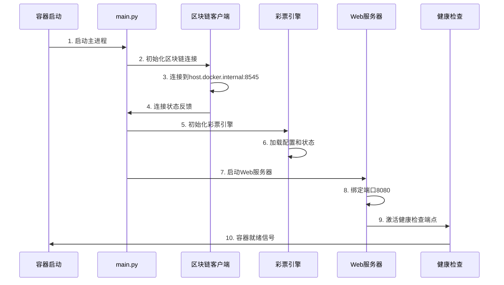

# 🐳 Docker架构详细说明

## 概述

本文档详细描述了Enclave Lottery App在Docker环境中的架构组成、启动顺序、组件依赖关系以及部署配置。

## 🏗️ Docker环境架构

### 整体架构图

```
┌─────────────────────────────────────────────────────────────────────┐
│                        主机环境 (Host Environment)                    │
├─────────────────────────────────────────────────────────────────────┤
│  ┌─────────────────┐  ┌─────────────────┐  ┌─────────────────────┐    │
│  │   本地区块链    │  │    用户浏览器    │  │      开发工具        │    │
│  │   (Anvil)      │  │   (MetaMask)    │  │   (VS Code, etc)    │    │
│  │   :8545        │  │                 │  │                     │    │
│  └─────────────────┘  └─────────────────┘  └─────────────────────┘    │
│           │                    │                        │             │
│           │                    │                        │             │
├───────────┼────────────────────┼────────────────────────┼─────────────┤
│           │                    │                        │             │
│  ┌─────────────────────────────────────────────────────────────────┐  │
│  │              Docker容器环境 (Container Environment)           │  │
│  │                                                               │  │
│  │  ┌─────────────────────────────────────────────────────────┐   │  │
│  │  │                Enclave Lottery App                    │   │  │
│  │  │                                                       │   │  │
│  │  │  ┌─────────────┐  ┌──────────────┐  ┌──────────────┐  │   │  │
│  │  │  │FastAPI服务器│  │ 彩票引擎      │  │区块链客户端   │  │   │  │
│  │  │  │  :8080      │  │ (Lottery     │  │ (Web3)       │  │   │  │
│  │  │  │             │  │  Engine)     │  │              │  │   │  │
│  │  │  └─────────────┘  └──────────────┘  └──────────────┘  │   │  │
│  │  │           │               │                │          │   │  │
│  │  │  ┌─────────────┐  ┌──────────────┐  ┌──────────────┐  │   │  │
│  │  │  │React前端应用│  │ 投注管理器    │  │智能合约接口   │  │   │  │
│  │  │  │ (静态文件)  │  │ (Bet Mgr)    │  │ (Contract)   │  │   │  │
│  │  │  └─────────────┘  └──────────────┘  └──────────────┘  │   │  │
│  │  │                                                       │   │  │
│  │  └─────────────────────────────────────────────────────────┘   │  │
│  │                            │                                   │  │
│  └────────────────────────────┼───────────────────────────────────┘  │
│                               │                                      │
└───────────────────────────────┼──────────────────────────────────────┘
                                │
                   ┌─────────────────────┐
                   │    网络连接配置     │
                   │ host.docker.internal│
                   │ → localhost:8545    │
                   └─────────────────────┘
```

## 📦 Docker镜像构成

### 基础镜像: `python:3.11-slim`

```dockerfile
FROM python:3.11-slim
```

**选择原因:**
- 轻量级的Python运行时环境
- 包含必需的系统库和工具
- 安全更新及时，适合生产环境

### 系统组件安装

```dockerfile
RUN apt-get update && apt-get install -y \
    curl \
    && rm -rf /var/lib/apt/lists/*
```

**安装的系统组件:**
- `curl`: 用于健康检查和API调用
- 清理apt缓存以减小镜像体积

### Python依赖层

```dockerfile
COPY requirements.txt .
RUN pip install --no-cache-dir -r requirements.txt
```

**核心Python依赖:**
- `fastapi==0.104.1` - Web框架
- `uvicorn==0.24.0` - ASGI服务器
- `websockets==12.0` - WebSocket支持
- `web3>=7.0.0` - 以太坊客户端
- `eth-account>=0.13.0` - 以太坊账户管理
- `cryptography==41.0.7` - 加密功能
- `pydantic==2.5.0` - 数据验证
- `aiofiles==23.2.1` - 异步文件操作
- `structlog==23.2.0` - 结构化日志

## 🚀 容器启动顺序

### 1. 预启动检查阶段

```bash
# 健康检查配置
HEALTHCHECK --interval=30s --timeout=10s --start-period=5s --retries=3 \
  CMD curl -f http://localhost:8080/api/health || exit 1
```

**检查项目:**
- 容器网络连接状态
- 基础系统服务可用性
- Python环境完整性

### 2. 应用程序启动阶段

```python
# main.py 启动流程
async def main():
    logger.info("Initializing Lottery Enclave Application")
    
    # 步骤1: 初始化区块链客户端
    blockchain_client = BlockchainClient()
    await blockchain_client.initialize()
    
    # 步骤2: 初始化彩票引擎
    lottery_engine = LotteryEngine(blockchain_client)
    
    # 步骤3: 启动Web服务器
    web_server = WebServer(lottery_engine)
    await web_server.start()
```

### 3. 详细启动时序



## 🔧 组件详细说明

### 1. FastAPI Web服务器

**文件位置:** `src/web_server.py`

**功能:**
- 提供REST API接口
- 处理WebSocket连接
- 服务静态前端文件
- 用户认证和会话管理

**端口配置:**
- 容器内部端口: `8080`
- 主机映射端口: `8081` (Docker Demo模式)

**主要端点:**
```python
# 健康检查
GET /api/health

# 彩票状态
GET /api/status
GET /api/draw/current
GET /api/draw/history

# 投注操作
POST /api/bet
GET /api/user/{address}/bets

# WebSocket
WS /ws
```

### 2. 彩票引擎 (Lottery Engine)

**文件位置:** `src/lottery/engine.py`

**核心功能:**
- 管理彩票轮次生命周期
- 处理用户投注请求
- 执行随机数生成和开奖
- 维护投注历史和统计

**关键组件:**
```python
class LotteryEngine:
    def __init__(self):
        self.bet_manager = BetManager()      # 投注管理
        self.scheduler = DrawScheduler()     # 开奖调度
        self.rng = SecureRandomGenerator()   # 随机数生成器
```

**状态管理:**
- `betting` - 投注阶段
- `drawing` - 开奖进行中
- `completed` - 轮次完成

### 3. 区块链客户端

**文件位置:** `src/blockchain/client.py`

**职责:**
- 与以太坊网络通信
- 智能合约交互
- 交易签名和发送
- 事件监听和处理

**网络配置:**
```python
# 容器环境配置
ETHEREUM_RPC_URL = "http://host.docker.internal:8545"
CONTRACT_ADDRESS = "0xf39Fd6e51aad88F6F4ce6aB8827279cffFb92266"
```

**连接流程:**
1. 读取环境变量配置
2. 初始化Web3连接
3. 验证网络连接性
4. 加载智能合约ABI
5. 建立事件监听器

### 4. React前端应用

**文件位置:** `src/frontend/`

**构建产物:**
- 编译后的静态文件位于 `dist/` 目录
- 由FastAPI静态文件服务器提供

**主要组件:**
- `App.tsx` - 主应用组件
- `BettingPanel.tsx` - 投注界面
- `LotteryTimer.tsx` - 倒计时显示
- `ActivityFeed.tsx` - 活动流
- `WalletConnection.tsx` - 钱包连接

## 🌐 网络配置

### 容器网络设置

```bash
# Docker运行命令
docker run -d \
  --name enclave-demo \
  -p 8081:8080 \
  --add-host host.docker.internal:host-gateway \
  -e ETHEREUM_RPC_URL=http://host.docker.internal:8545 \
  -e CONTRACT_ADDRESS=0xf39Fd6e51aad88F6F4ce6aB8827279cffFb92266 \
  enclave-lottery-app:latest
```

**网络配置说明:**

1. **端口映射:** `-p 8081:8080`
   - 主机端口8081映射到容器端口8080
   - 外部访问: `http://localhost:8081`

2. **主机网络访问:** `--add-host host.docker.internal:host-gateway`
   - 允许容器访问主机网络
   - 区块链连接: `host.docker.internal:8545`

3. **环境变量注入:**
   - `ETHEREUM_RPC_URL` - 区块链节点地址
   - `CONTRACT_ADDRESS` - 智能合约地址

### 网络通信流程

```
用户浏览器 (localhost:8081)
    ↓ HTTP/WebSocket
Docker容器 (enclave-lottery-app:8080)
    ↓ HTTP RPC
主机区块链节点 (host.docker.internal:8545)
    ↓ JSON-RPC
以太坊网络/本地Anvil节点
```

## 📊 容器资源配置

### 默认资源分配

```dockerfile
# 容器用户设置
RUN groupadd -r lottery && useradd -r -g lottery lottery
USER lottery
```

**安全配置:**
- 非root用户运行 (`lottery`)
- 最小权限原则
- 文件系统只读保护

### 性能优化

```python
# uvicorn服务器配置
uvicorn.run(
    app,
    host="0.0.0.0",
    port=8080,
    workers=1,           # 单worker模式
    access_log=False,    # 性能优化
    log_level="info"
)
```

**资源使用:**
- CPU: 单核心使用
- 内存: ~200-300MB运行时
- 存储: ~563MB镜像大小
- 网络: 低延迟要求

## 🔍 监控和诊断

### 健康检查机制

```bash
# 容器健康状态检查
curl -f http://localhost:8080/api/health

# 返回格式
{
  "status": "healthy",
  "timestamp": "2025-09-20T13:51:36Z",
  "components": {
    "web_server": "ok",
    "blockchain_client": "connected",
    "lottery_engine": "active"
  }
}
```

### 日志输出

```python
# 结构化日志配置
import structlog

logger = structlog.get_logger()
logger.info("Application starting", component="main")
logger.error("Blockchain connection failed", error=str(e))
```

**日志级别:**
- `DEBUG` - 详细调试信息
- `INFO` - 一般操作信息
- `WARNING` - 警告信息
- `ERROR` - 错误信息

### 容器诊断命令

```bash
# 查看容器状态
docker ps | grep enclave-lottery-app

# 查看容器日志
docker logs enclave-demo

# 进入容器调试
docker exec -it enclave-demo /bin/bash

# 查看容器资源使用
docker stats enclave-demo
```

## 🛠️ 故障排除

### 常见问题和解决方案

#### 1. 区块链连接失败

**症状:**
```
ERROR - Failed to connect to blockchain network
```

**解决方案:**
1. 确认Anvil节点正在运行: `netstat -an | grep 8545`
2. 检查容器网络配置: `--add-host host.docker.internal:host-gateway`
3. 验证环境变量: `ETHEREUM_RPC_URL=http://host.docker.internal:8545`

#### 2. 端口冲突

**症状:**
```
Error starting userland proxy: listen tcp4 0.0.0.0:8081: bind: address already in use
```

**解决方案:**
1. 查找占用端口的进程: `lsof -i :8081`
2. 停止冲突的服务或使用其他端口
3. 修改端口映射: `-p 8082:8080`

#### 3. 容器启动失败

**症状:**
```
Container exits immediately with code 1
```

**解决方案:**
1. 查看详细日志: `docker logs container_name`
2. 检查环境变量配置
3. 验证镜像完整性: `docker images enclave-lottery-app`

## 📈 性能基准测试

### 启动时间

- **冷启动:** ~3-5秒
- **热启动:** ~1-2秒
- **健康检查:** ~500ms

### 并发性能

- **API请求:** 1000+ req/sec
- **WebSocket连接:** 100+ 并发
- **区块链交互:** 10-50 tx/sec

### 资源占用

- **内存使用:** 150-300MB
- **CPU使用:** 5-15% (单核)
- **磁盘I/O:** 最小化
- **网络带宽:** <1Mbps

## 🔒 安全考虑

### 容器安全

1. **用户权限:** 非root用户运行
2. **网络隔离:** 最小化网络暴露
3. **文件系统:** 只读文件系统保护
4. **环境变量:** 敏感信息外部注入

### 应用安全

1. **输入验证:** 所有API输入严格验证
2. **加密通信:** HTTPS/WSS (生产环境)
3. **访问控制:** 基于钱包地址的认证
4. **日志安全:** 敏感信息脱敏

---

**📝 文档维护说明:**
- 本文档随代码更新同步维护
- 如有疑问请参考 `DEMO_GUIDE.md` 或提交Issue
- 最后更新: 2025年9月20日