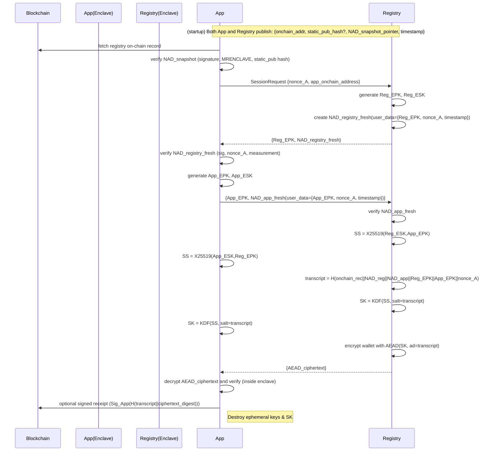

Nice — here's a complete, practical design you can implement so **both** Nitro-enclave nodes mutually verify each other and the **registry-node** securely transfers an ETH wallet (address + private key) to the **app-node**. I’ll give the threat model, assumptions, concrete message-level protocol, recommended crypto primitives, defenses, and a clear sequence diagram (Mermaid).

---

# Goals & threat model

* Mutual trust: each side must be sure the other is running approved enclave code (no impersonation).
* Freshness: prevent replay of stale attestations or keys.
* Confidentiality & integrity: wallet private key must only be available to the intended attested app enclave.
* Forward secrecy: compromise of long-term keys cannot reveal past sessions.
* Auditability: all actions can be proven/verified on-chain without leaking secrets.

# Assumptions

* Both registry-node and app-node run inside AWS Nitro Enclaves and can produce Nitro Attestation Documents (NADs) that the other party can verify using AWS attestation roots.
* Both nodes write a registration record to blockchain at startup containing: `{node_address, node_pub_static (optional), attestation_snapshot_hash_or_doc_pointer, timestamp}`.
* Each enclave can: generate ephemeral keypairs, include arbitrary user-data in NAD, and perform crypto (X25519, HKDF, AEAD).
* Both parties have access to Nitro attestation root certs and optionally a policy whitelist of expected enclave measurements (MRENCLAVE) or signed policies.

---

# High-level design (short)

1. Each node registers on-chain an attestation-bound identity (for discovery).
2. App discovers registry via blockchain and verifies its on-chain attestation snapshot.
3. App initiates a session with a fresh challenge (nonce\_A).
4. Registry responds with a fresh NAD that binds nonce\_A and the registry ephemeral public key (Reg\_EPK).
5. App verifies registry NAD, produces its own NAD binding nonce\_A (or nonce\_B) and App\_EPK, and returns it.
6. Registry verifies App NAD; both derive ephemeral session key via X25519; they use HKDF and an explicit transcript as salt/info.
7. Registry encrypts wallet (or wallet wrapped for app enclave public key) with AEAD under session key and sends it.
8. App decrypts inside its enclave, verifies transcript, and optionally publishes a signed receipt to chain for audit.

---

# Detailed message flow & exact checks

## Notation

* `NAD_X(...)` = Nitro Attestation Document from node X including listed fields.
* `Reg_EPK` / `Reg_ESK` = registry ephemeral X25519 public/private
* `App_EPK` / `App_ESK` = app ephemeral X25519 public/private
* `nonce_A`, `nonce_B` = random nonces (≥128 bits)
* `KDF(...)` = HKDF-SHA256
* `AEAD_Enc(key, ad, plaintext)` / `AEAD_Dec(...)` = AEAD (ChaCha20-Poly1305 or AES-GCM)
* `transcript = H(onchain_record || NAD_reg_digest || NAD_app_digest || Reg_EPK || App_EPK || nonces)`

## 0. On-chain registration (both nodes at startup)

* Each node (Registry & App) inside its enclave:

  * Generates (or uses) `static_pub` (optional).
  * Produces a Nitro Attestation Document `NAD_node(static_pub_hash, measurement, timestamp)` that cryptographically binds the static public key or a digest.
  * Publishes on-chain: `{node_address, static_pub (or its hash), NAD_node_pointer_or_digest, timestamp}`.
* Purpose: discovery + anchor for later verification. On-chain record must not include secrets.

## 1. App discovers & verifies registry snapshot

* App reads registry on-chain record. It fetches `NAD_registry_snapshot` (or its digest) from the pointer and:

  * Verifies NAD signature (AWS root).
  * Verifies measurement (MRENCLAVE) against allowed list or policy.
  * Verifies that `static_pub` hash matches the on-chain record.
  * Checks timestamp and revocation status (if used).
* If any check fails → abort.

## 2. App initiates session (freshness)

* `App → Registry` (over TLS or plain TCP initially; the first messages are protected by NADs & transcript):

  ```
  SessionRequest = { nonce_A, app_onchain_address, NAD_app_snapshot_pointer (optional) }
  ```

  * nonce\_A is random (128+ bits) to force fresh attestation binding.

## 3. Registry returns fresh attestation that binds ephemeral key

* Inside registry enclave:

  * Generate ephemeral X25519 pair: `(Reg_EPK, Reg_ESK)`.
  * Produce `NAD_registry_fresh` which includes: `{Reg_EPK, nonce_A, timestamp, measurement, optional static_pub_hash}` in NAD user-data.
  * Return to App: `{Reg_EPK, NAD_registry_fresh}`.

**Registry checks:** Registry should also optionally verify that SessionRequest references a valid app on-chain registration before proceeding.

## 4. App verifies registry fresh NAD

* App verifies `NAD_registry_fresh`:

  * NAD signature (AWS root), `nonce_A` equals what it sent, `Reg_EPK` included in NAD user data, measurement allowed, timestamp is recent.
* If check fails → abort.

## 5. App creates its ephemeral key & responsive NAD

* Inside app enclave:

  * Generate `(App_EPK, App_ESK)`.
  * Produce `NAD_app_fresh` including `{App_EPK, nonce_A (or nonce_B), timestamp, measurement}`.
  * Send to registry: `{App_EPK, NAD_app_fresh, optional app_onchain_sig}`.

## 6. Registry verifies app NAD

* Registry enclave verifies NAD signature, that `nonce_A` (or provided `nonce_B`) matches binding, and measurement is allowed.
* If check fails → abort.

## 7. Session key derivation & transcript binding

* Both compute shared secret:

  ```
  SS = X25519(Reg_ESK, App_EPK)  (== X25519(App_ESK, Reg_EPK))
  ```
* Compute `transcript = H(onchain_registry_record || onchain_app_record || digest(NAD_registry_fresh) || digest(NAD_app_fresh) || Reg_EPK || App_EPK || nonce_A || nonce_B(optional))`
* Derive `SK = KDF(SS, salt=transcript, info="reg-app-session")`
* Use `SK` for AEAD encryption and message authentication.

**Why transcript?** binds session key to the exact attestation documents and on-chain anchors, preventing mix-and-match or downgrade attacks.

## 8. Registry encrypts wallet and sends

* Two strong options (choose based on your security preferences):

### Option A — Direct encrypted transfer (session-only)

* `plaintext = { wallet_address, wallet_private_key }`
* `ciphertext = AEAD_Enc(SK, ad=transcript, plaintext)`
* `Registry → App`: `{ ciphertext, nonce_aead }`

### Option B — Envelope: encrypt under App static/attested key

* Registry uses `App_static_pub_from_NAD` (if NAD binds a static pubkey) or `App_EPK`:

  * Compute `enc_key_for_app = KDF( X25519(Reg_ESK, App_static_pub) || transcript )` or encrypt `wallet_private_key` asymmetrically using app enclave public key included in NAD (preferred if static pub exists).
  * Send encrypted key material plus AEAD envelope with SK over transcript.
* Advantage: if session SK compromised later, the private key was additionally encrypted to the app enclave public key.

> Implementation detail: keep wallet generation and private key creation inside registry enclave (or use HSM/KMS) and never write plain private key to disk outside enclave.

## 9. App decrypts & confirms

* App inside enclave uses `SK` to AEAD-decrypt using `transcript` as associated data.
* Verify wallet address matches derived data (e.g., derive address from private key and compare).
* Optionally, App posts a signed receipt to chain:

  ```
  Receipt = Sig_App(private_key_of_app_enclave_static?, H(transcript || ciphertext_digest || timestamp))
  ```

  This provides a non-secret on-chain audit that app received material.

## 10. Clean-up

* Immediately zero ephemeral secrets (`Reg_ESK`, `App_ESK`, `SS`, derived SK material).
* Optionally re-seal the wallet key inside app enclave (use Nitro/SEV sealing APIs) and only export wrapped key if required.

---

# Recommended crypto primitives & parameters

* Ephemeral ECDH: X25519 (Curve25519)
* KDF: HKDF-SHA256
* AEAD: ChaCha20-Poly1305 (or AES-256-GCM if required by environment)
* Signature validation for NAD: verify Nitro attestation via AWS Nitro attestation root and expected claims
* Nonces: 16+ bytes cryptographically random
* Transcript hash: SHA-256
* Timestamps: require NAD timestamp freshness (e.g., ≤ 2–5 minutes) and nonce matches to ensure liveness

---

# Audit & revocation

* Keep `NAD_snapshot_digest` on-chain. If node measurement changes or key is rotated, node must re-attest and update on-chain record.
* If suspect compromise: publish a revocation flag on-chain that causes other nodes to refuse sessions.
* Keep small on-chain proof of delivery (e.g., `H(transcript || ciphertext)` or `Sig_reg(transcript)`) so that audit can show which attested pair exchanged which encrypted blob — without exposing secrets.

---

# Alternate & advanced options (pick one)

* **Remote signing**: Instead of exporting private key, registry signs transactions on behalf of app after mutual attestation. The app sends transaction payloads to registry enclave which returns signed txs. This avoids key distribution entirely.
* **Threshold keys / MPC**: Use threshold signing so no single enclave holds the full private key.
* **Noise Protocol**: Use a Noise pattern (e.g., `Noise_XK` with attestation-bound static keys) to get proven security properties and a well-defined handshake.
* **AWS KMS + Enclave Sealing**: Use KMS to wrap keys and only unwrap inside enclave; registry can pass wrapped key to app which can unwrap if it has KMS access and attested role.

---

# Security checklist (must-haves)

* Fresh NADs bound to ephemeral keys with nonces.
* Verify NAD signatures and measurements against a policy.
* Transcript-binding for all derived keys and AEAD AD.
* Ephemeral ECDH for forward secrecy.
* Do not store private keys in plaintext outside enclave; if you must persist, seal them.
* Zero-out secrets after use.
* On-chain records only contain public metadata and NAD pointers/hashes — never secrets.

---

# Sequence diagram (Mermaid)



---

If you want, I can:

* Provide a ready-to-implement *Noise* handshake profile that includes the NAD fields and exact message bytes and KDF usage.
* Give sample pseudo-code (Go/Rust) that demonstrates NAD generation, verification, X25519 HKDF, AEAD usage, and sealing/unsealing inside Nitro.
* Or produce a compact threat model checklist tailored to your exact deployment.

Which of those would be most helpful next?
